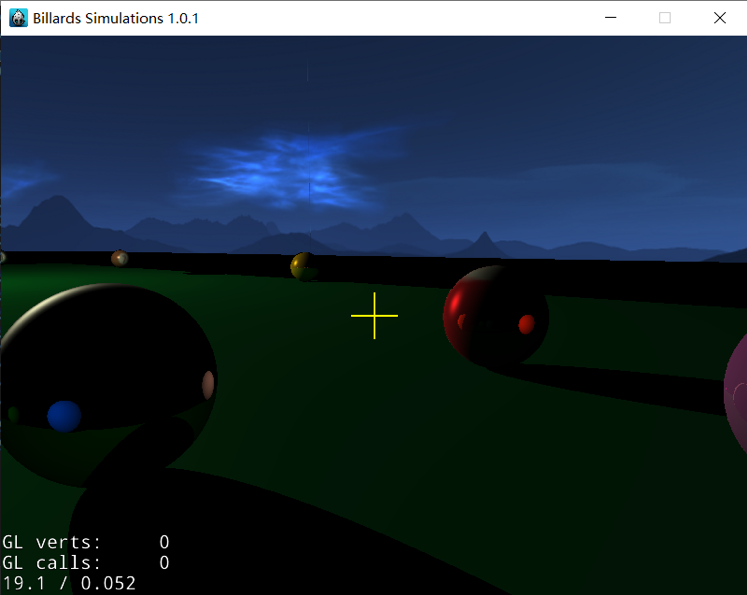
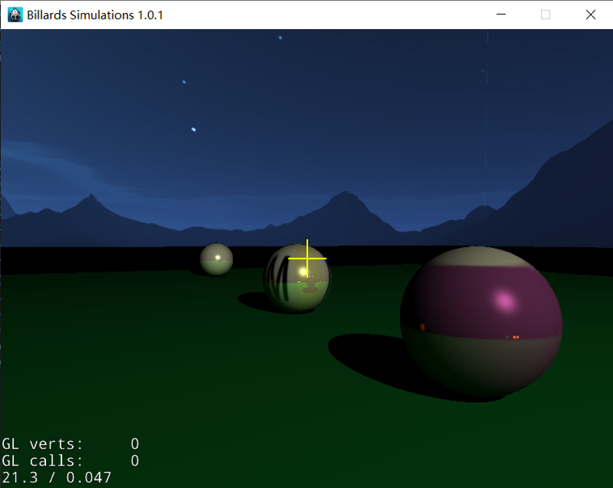

# Bimulator

> **Course project of CG(2019 fall)**: A billiard simulator using both ray tracing and graphics pipeline.

## Group Members

**Jiawei Liu**(@[ganler](https://github.com/ganler)) => Graphics Pipeline + Merging + Document + Project Management

**Xiaodong Bi**(@[bxdd](https://github.com/bxdd)) => Framework + Physical Engine(`Box2D`) + Document

**Zhengrui Qin**(@[MilesChing](https://github.com/MilesChing)) =>Ray Tracing + Document

**Xumai Qi** => Graphics Pipeline + Merging + Document

**Xiaowei Liu** => Document

**Xin Wen** => Document

> *Our group is advised by [Prof. Junqiao Zhao](https://scholar.google.com/citations?user=KPHJVAwAAAAJ&hl=en). Jiawei and Xiaodong take the lead in this project. 
> *[Course Page](http://cs1.tongji.edu.cn/courses/CS100433/)
> *[Our project is also available in the course page](http://cs1.tongji.edu.cn/courses/CS100433/CS100433_StudentProjects_2019.html#group5)

## What is a "bimulator"?

- Billiard Simulator.
- Physical Engine(`Box2D`) to simulate the movement of billiards.
- [**impl.**] Graphics pipeline.
- [**impl.**] Real-time ray tracing. (*Zhengrui Qin* also maintained his `WenTracing` in his [repo](https://github.com/MilesChing/WenTracing))
- [**merge**] merged using pixel shader(implemented via fragments shader). 

## Demos

> For more details(demo videos), see [GOOGLE-DRIVE](https://drive.google.com/drive/folders/1zqsDDTTqnVK11VnejBjC5584iCRfDQby?usp=sharing).

## Compile Me!

### Supported OS

- This project is developed under Windows 10.

> *It seems that it cannot work with Intel's graphic card's power saving mode.

### 3rd Parties Dependencies

- AMP
- OpenCV - 3.20
- Cocos2dx-3.17  
- GLM
- GLFW3
