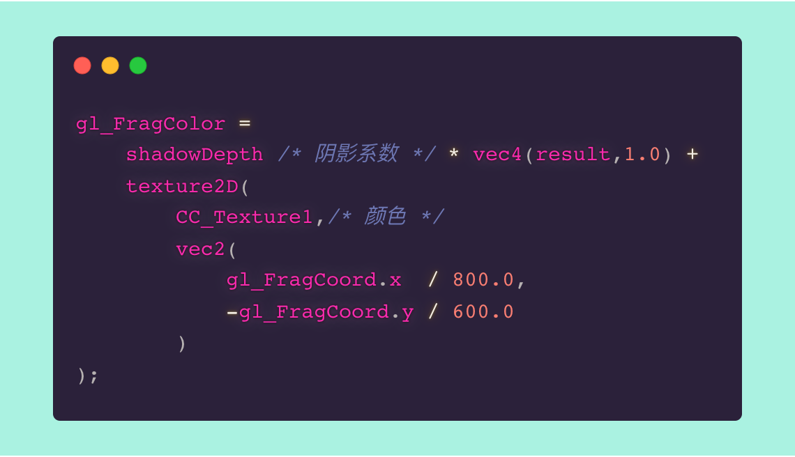

# Bimulator

> **Course project of CG(2019 fall)**: A billiard simulator using both ray tracing and graphics pipeline.

## Teamates

**Xiaodong Bi**(@[bxdd](https://github.com/bxdd)) => Framework + Physical Engine(`Box2D`) + Document

**Jiawei Liu**(@[ganler](https://github.com/ganler)) => Graphics Pipeline + Merging + Document

**Zhengrui Qin**(@[MilesChing](https://github.com/MilesChing)) =>Ray Tracing + Document

**Xumai Qi** => Graphics Pipeline + Merging + Document

**Xiaowei Liu** => Document

**Xin Wen** => Document

## What's this?

- Billiard Simulator.
- Physical Engine(`Box2D`) to simulate the movement of billiards.
- [**impl.**] Graphics pipeline.
- [**impl.**] Real-time ray tracing. (*Zhengrui Qin* also maintained his `WenTracing` in his [repo](https://github.com/MilesChing/WenTracing))
- [**merge**] merged using pixel shader(implemented via fragments shader). 

> The RT procedure produces a `cv::Mat`, and we used it as a texture. Then we combined their colors as follows.
>
> 

## Scene

## Building

### OS

- Windows 10

> It seems that it cannot work with Intel's graphic card's power saving mode.

### 3rd Party

- AMP
- OpenCV - 3.20
- Cocos2dx-3.17  
- GLM
- GLFW3